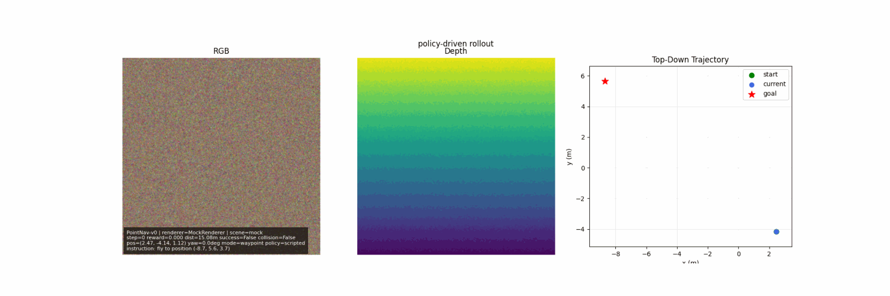
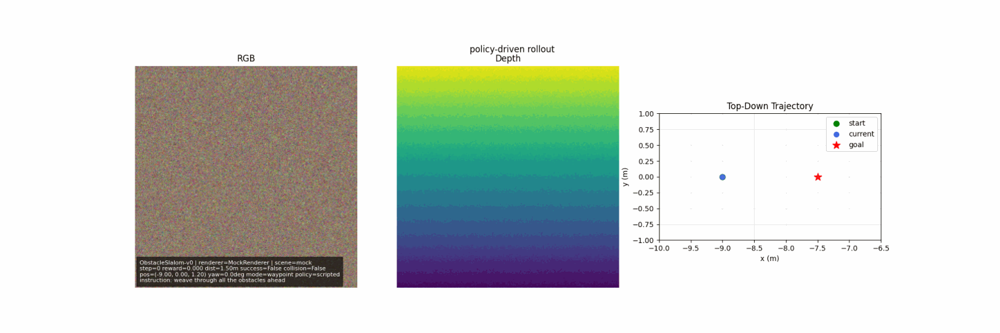
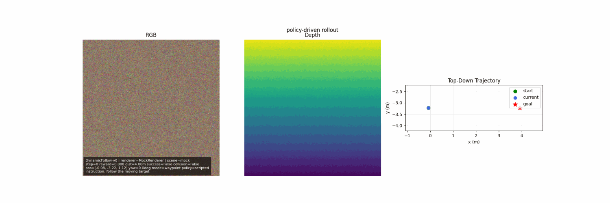
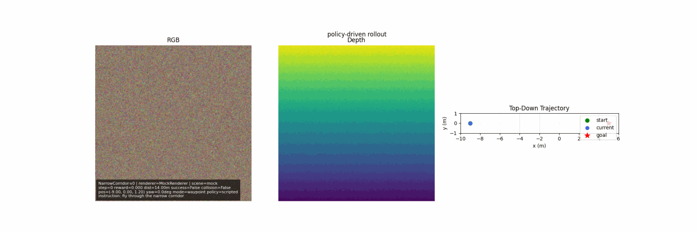
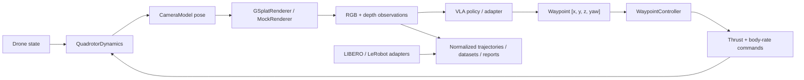

# GS-DroneGym

<p align="center">
  <a href="https://github.com/09Catho/gs-dronegym"></a>
  
  
  
</p>

Photorealistic drone simulation and cross-benchmark trajectory tooling for vision-language-action research.

GS-DroneGym starts from one very specific problem: **VLA-AN** identifies the visual sim-to-real domain gap as a central blocker for drone VLA systems, while **RaceVLA** shows that aerial VLA policies can work but still struggle with safety, temporal reasoning, and real-world generalization. This project turns that motivation into a usable stack: a drone simulator that renders from **3D Gaussian Splatting scenes**, exports **waypoint-supervised trajectories**, and now also speaks a shared benchmark/data language across **GS-DroneGym**, **LIBERO**, and **LeRobot-format** datasets.

## Why This Exists

- Drone VLA papers need a safer place to iterate than physical flights.
- Synthetic simulators do not match real-world visuals closely enough.
- VLA-AN-style waypoint policies need a proper environment, controller, and dataset pipeline.
- Research groups rarely use only one benchmark, so data and evaluation tooling needs to cross boundaries.

## Visuals

**Keyboard-style flight demo**



This GIF shows the same movement primitives used in manual keyboard mode.  
The RGB panel is the drone camera view, the depth panel is estimated distance, and the top-down panel is the moving trajectory graph.  
When you fly manually, your keypresses change the control command and that path updates live.

**Obstacle slalom task**



This scenario shows the drone trying to move through a sequence of obstacles rather than just flying to a point.  
The top-down panel is useful here because you can immediately see whether the path is weaving cleanly or drifting into collisions.

**Dynamic follow task**



This task is about tracking a moving target instead of reaching a fixed goal.  
The moving graph shows whether the drone trajectory stays close to the target path over time, which is useful for temporal-control debugging.

**Narrow corridor task**



This task stresses precision and safety in tight spaces.  
The trajectory plot makes it obvious when the drone stays centered versus scraping into the corridor walls.

## What You Get

- 6-DOF quadrotor dynamics with RK4 integration
- waypoint controller for `[x, y, z, yaw]` supervision
- `gsplat`-backed photorealistic rendering with CPU fallback
- five built-in drone navigation tasks
- shared trajectory schema for rollouts and offline datasets
- adapters for GS-DroneGym, LIBERO, and LeRobot-format data
- lightweight behavior-cloning baseline
- CLI tools for dataset inspection, training, evaluation, and live viewing

## Install

Core:

```bash
pip install gs-dronegym
```

With CUDA `gsplat`:

```bash
pip install gs-dronegym[cuda]
```

With LIBERO support:

```bash
pip install gs-dronegym[libero]
```

With LeRobot-format dataset support:

```bash
pip install gs-dronegym[lerobot]
```

Everything benchmark-related:

```bash
pip install gs-dronegym[benchmarks]
```

## Quickstart

```python
import gs_dronegym

env = gs_dronegym.make("PointNav-v0", scene=None)
obs, info = env.reset(seed=0)
obs, reward, terminated, truncated, info = env.step(env.action_space.sample())

print(obs["instruction"])
print(obs["rgb"].shape, obs["depth"].shape, obs["state"].shape)
```

## Architecture



## Drone Tasks

| Task | Description | Success Metric | Max Steps |
| --- | --- | --- | ---: |
| `PointNav-v0` | Fly to a sampled 3D coordinate inside the scene. | Reach goal within `0.5 m`. | 200 |
| `ObjectNav-v0` | Fly to a language-described semantic region. | Reach sampled region goal within `0.5 m`. | 200 |
| `ObstacleSlalom-v0` | Weave through five sequential obstacle gates. | Clear all gates and reach the finish. | 200 |
| `DynamicFollow-v0` | Track a moving target on a circular trajectory. | Stay within `1.0 m` for 15 consecutive steps. | 200 |
| `NarrowCorridor-v0` | Traverse a tight straight corridor without collision. | Reach corridor exit within `0.5 m`. | 200 |

## Cross-Benchmark Layer

GS-DroneGym v0.2 adds a common data and evaluation layer:

- `TaskSpec`, `ActionSpec`, `ObservationSpec`
- `TrajectoryStep`, `TrajectoryEpisode`
- `BenchmarkReport`
- `make_benchmark(...)`
- `load_dataset(..., format="gs_dronegym" | "libero" | "lerobot")`

This means the same project can:
- run live drone simulation
- export normalized drone trajectories
- inspect external datasets
- train a baseline policy
- emit standardized benchmark reports

## CLI

Inspect a dataset:

```bash
gs-dronegym-inspect-dataset path/to/dataset --format lerobot
```

Train behavior cloning:

```bash
gs-dronegym-train-bc path/to/dataset --format gs_dronegym --epochs 3 --checkpoint outputs/policy.pt
```

Evaluate:

```bash
gs-dronegym-evaluate --benchmark gs_dronegym --env-id PointNav-v0 --n-episodes 5
```

Launch the viewer:

```bash
gs-dronegym-live-view --env-id PointNav-v0 --scene None --steps 60
```

Save a GIF without opening a window:

```bash
gs-dronegym-live-view --env-id PointNav-v0 --scene None --steps 60 --no-show --save-gif outputs/live_view.gif
```

Manual flight mode:

```bash
gs-dronegym-live-view --env-id PointNav-v0 --scene None --policy keyboard --action-mode waypoint
```

Generate a keyboard-style demo GIF:

```bash
gs-dronegym-live-view --env-id PointNav-v0 --scene None --policy scripted --steps 60 --no-show --save-gif outputs/keyboard_demo.gif
```

Real Gaussian scene:

```bash
gs-dronegym-live-view --env-id PointNav-v0 --scene C:\path\to\scene.ply --renderer-device cuda --policy keyboard
```

Viewer controls:

- `I/K`: forward/back
- `J/L`: left/right
- `U/O`: up/down
- `N/M`: yaw left/right
- `P`: pause
- `R`: reset
- `Esc`: quit

## Examples

The [`examples/`](examples) folder includes:

- `export_drone_rollout.py`
- `live_viewer.py`
- `load_libero_dataset.py`
- `load_lerobot_dataset.py`
- `train_bc.py`
- `evaluate_benchmark.py`

## Next Phase

The next major step is to turn GS-DroneGym from a simulator plus benchmark layer into a **dataset factory for aerial VLA training**.

Planned work:

1. **Synthetic VLA-AN-style dataset creation**
   - task-conditioned rollouts with language, RGB, depth, state history, and expert next-waypoint supervision
   - staged exports for scene grounding, short-horizon flight skills, and long-horizon navigation
   - dataset writers for Parquet / Hugging Face-friendly formats

2. **Expert planner and safety supervision**
   - collision-aware path generation
   - dense waypoint extraction
   - corrective targets and safety labels for recovery behavior

3. **Task synthesis at scale**
   - templated and paraphrased language instructions
   - object/region-driven task generation
   - synthetic curriculum generation over scenes, goals, and obstacles

4. **Benchmark-grade reporting**
   - reproducible splits
   - baseline comparison tables
   - dataset cards and benchmark summaries

## References

- [VLA-AN: An Efficient and Onboard Vision-Language-Action Framework for Aerial Navigation in Complex Environments](https://arxiv.org/abs/2512.15258)
- [RaceVLA: VLA-based Racing Drone Navigation with Human-like Behaviour](https://arxiv.org/abs/2503.02572)
- [LIBERO: Benchmarking Knowledge Transfer for Lifelong Robot Learning](https://arxiv.org/abs/2306.03310)
- [LeRobot GitHub](https://github.com/huggingface/lerobot)
- [Hugging Face LeRobot Docs](https://huggingface.co/docs/lerobot)

## Development

```bash
pip install -e .[dev]
python -m ruff check .
python -m pytest -q
```

The core path remains CPU-only and testable with `MockRenderer`. Optional GPU rendering and external benchmark integrations are import-gated.

## Current Scope

This is strong **research infrastructure**, not a polished end-user product yet. It is designed for:

- sim-to-real drone VLA research
- dataset generation and inspection
- cross-benchmark prototyping
- lab demos and internal experimentation

## Citation

```bibtex
@software{saxena2025gsdronegym,
  author = {Saxena, Atul},
  title  = {GS-DroneGym: Photorealistic Simulation for VLA Drone Navigation},
  year   = {2025},
  url    = {https://github.com/09Catho/gs-dronegym}
}
```
