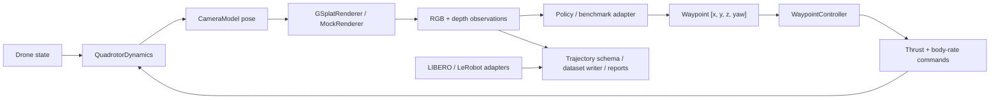

# GS-DroneGym

<p align="center">
  <a href="https://github.com/09Catho/gs-dronegym"></a>
  
  
  
</p>

Photorealistic drone simulation, synthetic aerial dataset generation, and cross-benchmark trajectory tooling for vision-language-action research.

GS-DroneGym is built around one problem: **VLA-AN** highlights the visual sim-to-real gap as a major blocker for drone VLA systems, while **RaceVLA** shows that aerial VLA policies can work but still degrade on safety and generalization. This project turns that motivation into a usable research stack: a drone simulator with **3D Gaussian Splatting rendering**, **waypoint supervision**, **task libraries**, and now a **synthetic VLA-AN-like dataset factory** plus shared tooling for **GS-DroneGym**, **LIBERO**, and **LeRobot-format** data.

## What This Repo Actually Does

GS-DroneGym can be used in four ways:

1. **Drone simulator**
   - run drone navigation tasks with RGB, depth, state, and language instructions
2. **Interactive viewer**
   - fly the drone manually and inspect RGB, depth, and top-down trajectories
3. **Synthetic dataset factory**
   - generate waypoint-supervised aerial datasets in Parquet shards
4. **Cross-benchmark data layer**
   - normalize, inspect, train on, and evaluate GS-DroneGym, LIBERO, and LeRobot-style trajectories

## What's New

- `v0.1`: core quadrotor simulator, renderer stack, tasks, metrics, and viewer
- `v0.2`: shared trajectory schema, benchmark adapters, dataset loaders, and behavior cloning baseline
- `v0.3`: synthetic VLA-AN-like dataset generation with staged curricula, expert waypoints, safety labels, Parquet shards, debug JSON episodes, preview CLI, and dataset validation

## Visual Demos

**Keyboard control demo**


This shows manual waypoint control in the live viewer.  
The left panel is RGB, the middle panel is depth, and the right panel is the top-down flight trace.  
As you press movement keys, the path and heading update in real time.

**Obstacle slalom**


This task checks whether the drone can weave through a structured obstacle course.  
The top-down view makes drift and near-collision behavior easy to inspect.

**Dynamic follow**


This task is about staying close to a moving target rather than reaching a fixed point.  
It is useful for debugging temporal control and tracking lag.

**Narrow corridor**


This stresses precision and safety in tight geometry.  
You can immediately see whether the drone stays centered or clips the corridor walls.

## Install

Core package:

```bash
pip install gs-dronegym
```

Editable install for development:

```bash
pip install -e .
```

CUDA rendering:

```bash
pip install gs-dronegym[cuda]
```

LIBERO support:

```bash
pip install gs-dronegym[libero]
```

LeRobot-format support:

```bash
pip install gs-dronegym[lerobot]
```

All benchmark extras:

```bash
pip install gs-dronegym[benchmarks]
```

## 5-Minute Start

### 1. Run the simulator

```python
import gs_dronegym

env = gs_dronegym.make("PointNav-v0", scene=None)
obs, info = env.reset(seed=0)
obs, reward, terminated, truncated, info = env.step(env.action_space.sample())

print(obs["instruction"])
print(obs["rgb"].shape, obs["depth"].shape, obs["state"].shape)
```

### 2. Open the live viewer

```bash
gs-dronegym-live-view --env-id PointNav-v0 --scene None --policy keyboard --action-mode waypoint
```

Keyboard mapping:

- `I/K`: forward/back
- `J/L`: left/right
- `U/O`: up/down
- `N/M`: yaw left/right
- `P`: pause
- `R`: reset
- `Esc`: quit

### 3. Generate a tiny synthetic dataset

```bash
gs-dronegym-generate-dataset outputs/synth_dataset --scenes mock://lab_a mock://lab_b --episodes-per-scene 12 --renderer-device cpu --allow-mock-rendering
```

### 4. Validate the generated dataset

```bash
gs-dronegym-validate-dataset outputs/synth_dataset
```

## Core Workflows

### Workflow A: Simulate a drone task

Use this when you want to prototype a policy, debug control logic, or inspect task behavior.

```bash
gs-dronegym-live-view --env-id PointNav-v0 --scene None --policy keyboard --action-mode waypoint
```

### Workflow B: Generate synthetic VLA-style data

Use this when you want training data with RGB, depth, drone state, language instruction, expert waypoint, and safety labels.

```bash
gs-dronegym-generate-dataset outputs/synth_dataset --scenes mock://lab_a mock://lab_b --episodes-per-scene 12 --renderer-device cpu --allow-mock-rendering
gs-dronegym-validate-dataset outputs/synth_dataset
```

### Workflow C: Preview a dataset task before generating at scale

Use this when you want to inspect a single scenario and save a GIF.

```bash
gs-dronegym-preview-dataset-task --scene None --stage stage2_flight_skills --task-id narrow_corridor --steps 40 --save-gif outputs/dataset_preview.gif --allow-mock-rendering
```

### Workflow D: Load a real Gaussian scene

Use this when you already have a Gaussian `.ply` from Nerfstudio or another 3DGS pipeline.

```bash
gs-dronegym-live-view --env-id PointNav-v0 --scene C:\path\to\scene.ply --renderer-device cuda --policy keyboard
```

For synthetic dataset generation on a real scene:

```bash
gs-dronegym-generate-dataset outputs/real_dataset --scenes C:\path\to\scene.ply --episodes-per-scene 12 --renderer-device cuda
```

## Synthetic Dataset Factory

GS-DroneGym v0.3 adds a staged aerial dataset generator designed to approximate the public ingredients described in **VLA-AN**.

Generated supervision per step:

- `instruction`
- `rgb`
- `depth`
- `state`
- `expert_waypoint = [x, y, z, yaw]`
- safety labels:
  - `collision_imminent`
  - `min_clearance_m`
  - `recovery_required`
  - `collision_occurred`
  - `success`

Curriculum stages:

- `stage1_scene_comprehension`
- `stage2_flight_skills`
- `stage3_long_horizon_navigation`

Output layout:

- `manifest.json`
- `splits.json`
- `episodes_debug/`
- `media/<split>/<shard>/rgb/*.png`
- `media/<split>/<shard>/depth/*.npy`
- `parquet/<split>/steps-xxxxx.parquet`
- `parquet/<split>/episodes.parquet`

Important note: this is a **VLA-AN-like approximation**, not a claim of exact reproduction of the paper's internal private dataset.

## Cross-Benchmark Layer

GS-DroneGym also includes a shared benchmark/data layer for:

- live drone rollouts
- normalized offline trajectories
- LIBERO adapters
- LeRobot-format dataset loading
- behavior cloning
- evaluation reports

Main interfaces:

- `TaskSpec`
- `ActionSpec`
- `ObservationSpec`
- `TrajectoryStep`
- `TrajectoryEpisode`
- `BenchmarkReport`
- `make_benchmark(...)`
- `load_dataset(..., format="gs_dronegym" | "libero" | "lerobot")`

## Built-In Drone Tasks

| Task | Description | Success Metric | Max Steps |
| --- | --- | --- | ---: |
| `PointNav-v0` | Fly to a sampled 3D coordinate. | Reach goal within `0.5 m`. | 200 |
| `ObjectNav-v0` | Fly to a language-described region. | Reach region goal within `0.5 m`. | 200 |
| `ObstacleSlalom-v0` | Pass through five obstacle gates in sequence. | Clear all gates and finish. | 200 |
| `DynamicFollow-v0` | Track a moving target. | Stay within `1.0 m` for 15 consecutive steps. | 200 |
| `NarrowCorridor-v0` | Traverse a tight corridor safely. | Reach corridor exit within `0.5 m`. | 200 |

## Architecture



## CLI Reference

Inspect a dataset:

```bash
gs-dronegym-inspect-dataset path/to/dataset --format gs_dronegym
```

Train behavior cloning:

```bash
gs-dronegym-train-bc path/to/dataset --format gs_dronegym --epochs 3 --checkpoint outputs/policy.pt
```

Evaluate:

```bash
gs-dronegym-evaluate --benchmark gs_dronegym --env-id PointNav-v0 --n-episodes 5
```

Live viewer:

```bash
gs-dronegym-live-view --env-id PointNav-v0 --scene None --steps 60
```

Save a GIF without opening a window:

```bash
gs-dronegym-live-view --env-id PointNav-v0 --scene None --steps 60 --no-show --save-gif outputs/live_view.gif
```

Generate a scripted keyboard-style demo GIF:

```bash
gs-dronegym-live-view --env-id PointNav-v0 --scene None --policy scripted --steps 60 --no-show --save-gif outputs/keyboard_demo.gif
```

## Examples

The [`examples/`](examples) folder includes:

- `export_drone_rollout.py`
- `generate_synthetic_dataset.py`
- `preview_synthetic_dataset.py`
- `live_viewer.py`
- `load_libero_dataset.py`
- `load_lerobot_dataset.py`
- `train_bc.py`
- `evaluate_benchmark.py`

## Real Scene Workflow

If you want real rendering instead of mock rendering:

1. capture a real room or outdoor space with images/video
2. build a Gaussian `.ply` with Nerfstudio or another 3DGS pipeline
3. pass that `.ply` into GS-DroneGym
4. run the viewer or dataset generator on top of that real scene

Example:

```bash
gs-dronegym-live-view --env-id PointNav-v0 --scene C:\path\to\scene.ply --renderer-device cuda --policy keyboard
```

## Next Phase

Planned work from here:

1. **Larger real-scene dataset generation**
   - better `gsplat` batching
   - multi-scene GPU scheduling
   - stronger resume/checkpoint behavior

2. **Richer expert supervision**
   - stronger recovery labels
   - better dynamic-target forecasting
   - optional low-level control labels in addition to waypoints

3. **Dataset publishing**
   - dataset cards
   - Hugging Face export helpers
   - benchmark tables for generated splits

## References

- [VLA-AN: An Efficient and Onboard Vision-Language-Action Framework for Aerial Navigation in Complex Environments](https://arxiv.org/abs/2512.15258)
- [RaceVLA: VLA-based Racing Drone Navigation with Human-like Behaviour](https://arxiv.org/abs/2503.02572)
- [LIBERO: Benchmarking Knowledge Transfer for Lifelong Robot Learning](https://arxiv.org/abs/2306.03310)
- [LeRobot GitHub](https://github.com/huggingface/lerobot)
- [Hugging Face LeRobot Docs](https://huggingface.co/docs/lerobot)

## Development

```bash
pip install -e .[dev]
python -m ruff check .
python -m pytest -q
```

The core path remains CPU-only and fully testable with `MockRenderer`. Optional GPU rendering and external benchmark integrations are import-gated.

## Citation

```bibtex
@software{saxena2025gsdronegym,
  author = {Saxena, Atul},
  title  = {GS-DroneGym: Photorealistic Simulation for VLA Drone Navigation},
  year   = {2025},
  url    = {https://github.com/09Catho/gs-dronegym}
}
```
