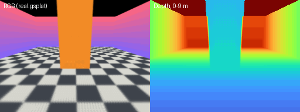
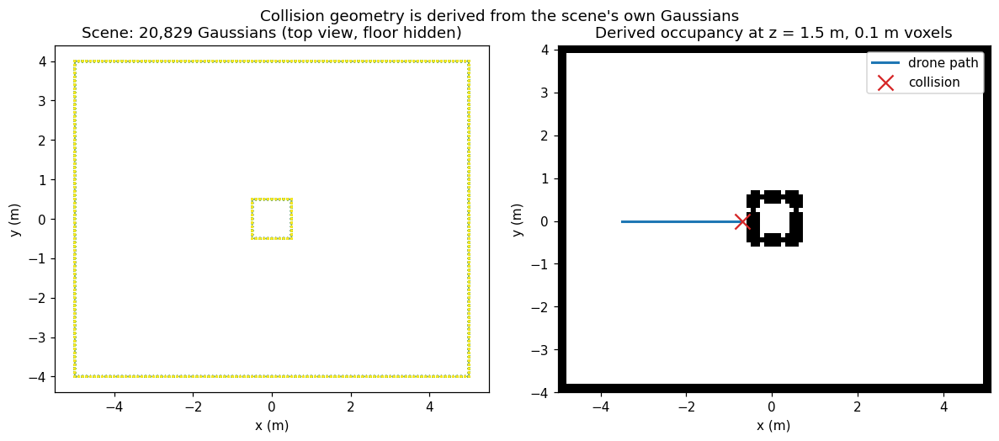
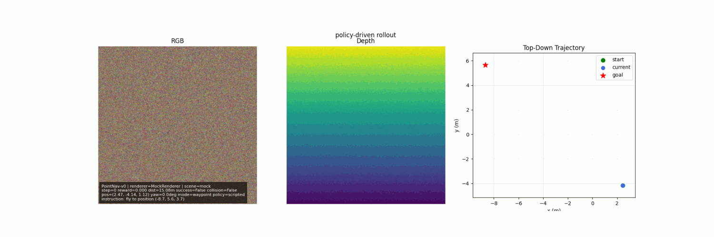
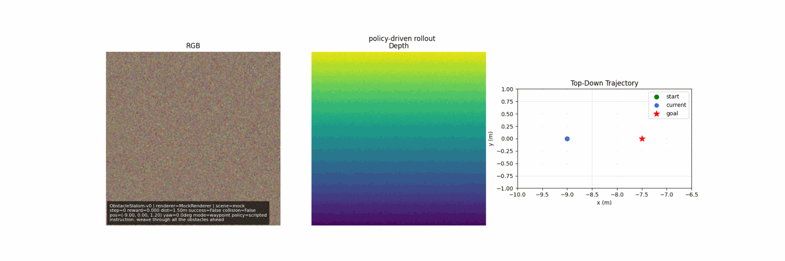
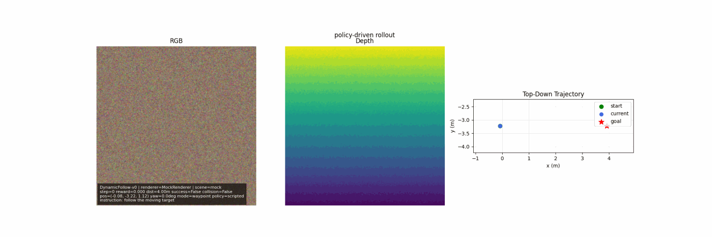
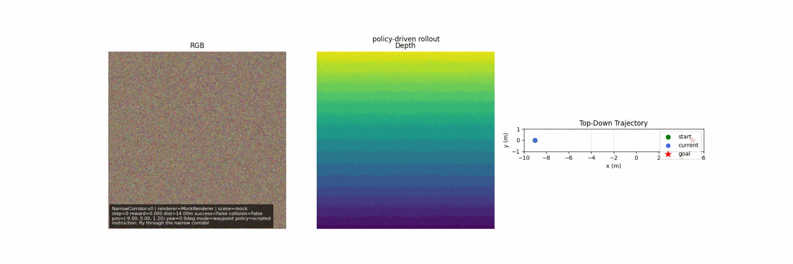
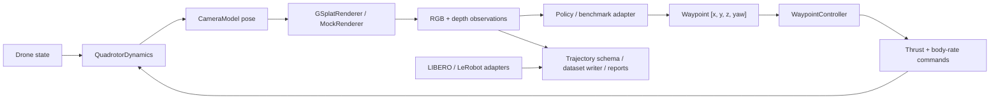

# GS-DroneGym

<p align="center">
  <a href="https://github.com/09Catho/gs-dronegym"></a>
  <a href="https://github.com/09Catho/gs-dronegym/actions/workflows/ci.yml"></a>
  
  
  
</p>

Photorealistic drone simulation, synthetic aerial dataset generation, and cross-benchmark trajectory tooling for vision-language-action research.

GS-DroneGym is built around one problem: **VLA-AN** highlights the visual sim-to-real gap as a major blocker for drone VLA systems, while **RaceVLA** shows that aerial VLA policies can work but still degrade on safety and generalization. This project turns that motivation into a usable research stack: a drone simulator with **3D Gaussian Splatting rendering**, **waypoint supervision**, **task libraries**, and now a **synthetic VLA-AN-like dataset factory** plus shared tooling for **GS-DroneGym**, **LIBERO**, and **LeRobot-format** data.

## What This Repo Actually Does

GS-DroneGym can be used in four ways:

1. **Drone simulator**
   - run drone navigation tasks with RGB, depth, state, and language instructions
2. **Interactive viewer**
   - fly the drone manually and inspect RGB, depth, and top-down trajectories
3. **Synthetic dataset factory**
   - generate waypoint-supervised aerial datasets in Parquet shards
4. **Cross-benchmark data layer**
   - normalize, inspect, train on, and evaluate GS-DroneGym, LIBERO, and LeRobot-style trajectories

## What's New

### On `main`, not yet on PyPI

**The real Gaussian renderer now works, verified on a GPU.**



Real `gsplat` rasterization on an NVIDIA T4: 81,649 Gaussians at 256×192, median 3.55 ms per frame including the copy back to host memory. This is the synthetic test room with a checkerboard floor, not a captured reconstruction. Three defects had kept the renderer from ever producing a correct image: Gaussian scales were passed without their exponential activation, the camera frame was never converted to the vision convention the rasterizer expects, and depth was read from an alpha-accumulated channel. None could surface on the development machine, where `gsplat` silently falls back to the mock renderer. Reproduce with `modal run tools/modal_render_readme_demo.py`.

**Collision geometry comes from the scene's own Gaussians.**



Obstacles used to be hand-authored boxes unrelated to the rendered image. Loading a Gaussian scene now derives navigation bounds and a voxel occupancy grid from that scene, and the drone collides against it. Checked against real rendered depth over 851 rays, the median error is 0.073 m at 0.1 m voxels, with 93.9% of rays within two voxels. Regenerate the figure with `python tools/make_scene_geometry_figure.py`.

**A reproducible environment that standard RL libraries can consume.**

- Seeding once and then calling `reset()` repeatedly now replays the same episode sequence. Previously only the first episode was reproducible, and augmented frames drifted by up to 43/255 at a fixed seed.
- Control, physics and camera rates are independent: `control_hz`, `physics_hz` and `camera_hz`, with `episode_time_limit_s` expressed in simulated seconds.
- `instruction_mode="features"` exposes a deterministic instruction encoding, so the observation space is all `Box`. `observation_mode="state"` skips rendering entirely.
- Behavior-cloning instruction features no longer change between processes, and checkpoints record an encoder version.
- Benchmark reports shrank from 621 MB to 1.5 KB by default.
- CI builds the wheel from a clean checkout and tests the installed package on Ubuntu and Windows for Python 3.10 and 3.11.

```python
import gs_dronegym

env = gs_dronegym.make(
    "PointNav-v0",
    scene=None,
    control_hz=10.0,
    camera_hz=5.0,
    instruction_mode="features",
)
obs, info = env.reset(seed=0)
```

Behavior-cloning results reported before these fixes are unreliable; see [`paper/claim_map.md`](paper/claim_map.md).

### Earlier releases

- `v0.1`: core quadrotor simulator, renderer stack, tasks, metrics, and viewer
- `v0.2`: shared trajectory schema, benchmark adapters, dataset loaders, and behavior cloning baseline
- `v0.3`: synthetic VLA-AN-like dataset generation with staged curricula, expert waypoints, safety labels, Parquet shards, debug JSON episodes, preview CLI, and dataset validation

## Visual Demos

The demos below run on the CPU **mock renderer**, which needs no GPU. Its RGB and depth panels are placeholder test signals, not images of a scene; the top-down trajectory panel is the real simulated flight. For output from the real Gaussian renderer, see [What's New](#whats-new).

**Keyboard control demo**



This shows manual waypoint control in the live viewer.  
The left and middle panels are the mock renderer's placeholder RGB and depth; the right panel is the top-down flight trace.  
As you press movement keys, the path and heading update in real time.

**Obstacle slalom**



This task checks whether the drone can weave through a structured obstacle course.  
The top-down view makes drift and near-collision behavior easy to inspect.

**Dynamic follow**



This task is about staying close to a moving target rather than reaching a fixed point.  
It is useful for debugging temporal control and tracking lag.

**Narrow corridor**



This stresses precision and safety in tight geometry.  
You can immediately see whether the drone stays centered or clips the corridor walls.

## Install

GS-DroneGym requires **Python 3.10 or newer**.

Check your Python version first:

```bash
python --version
```

Install from PyPI:

```bash
pip install gs-dronegym
```

> **Note:** PyPI currently has `0.3.0`, which predates the renderer, reproducibility and packaging fixes on `main` described in [What's New](#whats-new). Until the next release, install from GitHub to get them.

If you see `No matching distribution found for gs-dronegym`, you are probably using Python `3.9` or older. Create a Python 3.10+ environment and install again:

```bash
conda create -n gs-dronegym python=3.11 -y
conda activate gs-dronegym
python -m pip install --upgrade pip
python -m pip install gs-dronegym
```

Install directly from GitHub:

```bash
pip install "gs-dronegym @ git+https://github.com/09Catho/gs-dronegym.git"
```

For development:

```bash
git clone https://github.com/09Catho/gs-dronegym.git
cd gs-dronegym
pip install -e .
```

For CUDA rendering extras from GitHub:

```bash
pip install "gs-dronegym[cuda]"
```

For LIBERO support:

```bash
pip install "gs-dronegym[libero]"
```

The `libero` extra only installs shared loader dependencies. Install the official LIBERO environment separately according to the upstream project you are using, because PyPI packages cannot depend on arbitrary GitHub repos.

For LeRobot-format support:

```bash
pip install "gs-dronegym[lerobot]"
```

For all benchmark extras:

```bash
pip install "gs-dronegym[benchmarks]"
```

## 5-Minute Start

### 1. Run the simulator

```python
import gs_dronegym

env = gs_dronegym.make("PointNav-v0", scene=None)
obs, info = env.reset(seed=0)
obs, reward, terminated, truncated, info = env.step(env.action_space.sample())

print(obs["instruction"])
print(obs["rgb"].shape, obs["depth"].shape, obs["state"].shape)
```

### 2. Open the live viewer

```bash
gs-dronegym-live-view --env-id PointNav-v0 --scene None --policy keyboard --action-mode waypoint
```

Keyboard mapping:

- `I/K`: forward/back
- `J/L`: left/right
- `U/O`: up/down
- `N/M`: yaw left/right
- `P`: pause
- `R`: reset
- `Esc`: quit

### 3. Generate a tiny synthetic dataset

```bash
gs-dronegym-generate-dataset outputs/synth_dataset --scenes mock://lab_a mock://lab_b --episodes-per-scene 12 --renderer-device cpu --allow-mock-rendering
```

For a focused Live PointNav debugging dataset, keep only `point_nav`:

```bash
gs-dronegym-generate-dataset outputs/pointnav_debug_dataset --scenes mock://pn_a mock://pn_b --episodes-per-scene 100 --renderer-device cpu --allow-mock-rendering --task-filter point_nav
```

### 4. Validate the generated dataset

```bash
gs-dronegym-validate-dataset outputs/synth_dataset
```

## Core Workflows

### Workflow A: Simulate a drone task

Use this when you want to prototype a policy, debug control logic, or inspect task behavior.

```bash
gs-dronegym-live-view --env-id PointNav-v0 --scene None --policy keyboard --action-mode waypoint
```

### Workflow B: Generate synthetic VLA-style data

Use this when you want training data with RGB, depth, drone state, language instruction, expert waypoint, and safety labels.

```bash
gs-dronegym-generate-dataset outputs/synth_dataset --scenes mock://lab_a mock://lab_b --episodes-per-scene 12 --renderer-device cpu --allow-mock-rendering
gs-dronegym-validate-dataset outputs/synth_dataset
```

### Workflow C: Preview a dataset task before generating at scale

Use this when you want to inspect a single scenario and save a GIF.

```bash
gs-dronegym-preview-dataset-task --scene None --stage stage2_flight_skills --task-id narrow_corridor --steps 40 --save-gif outputs/dataset_preview.gif --allow-mock-rendering
```

### Workflow D: Load a real Gaussian scene

Use this when you already have a Gaussian `.ply` from Nerfstudio or another 3DGS pipeline.

> **Status:** the real renderer has been verified on a Linux GPU against a synthetic Gaussian scene. Captured reconstructions load through the same path, but their coordinate frame, scale and navigation bounds have not yet been validated. On native Windows, `gsplat` cannot build its CUDA extension without MSVC and the renderer falls back to the mock path.

```bash
gs-dronegym-live-view --env-id PointNav-v0 --scene C:\path\to\scene.ply --renderer-device cuda --policy keyboard
```

For synthetic dataset generation on a real scene:

```bash
gs-dronegym-generate-dataset outputs/real_dataset --scenes C:\path\to\scene.ply --episodes-per-scene 12 --renderer-device cuda
```

You can also use the built-in public scene handles. These currently resolve to large NerfBaselines Gaussian Splatting archives hosted on Hugging Face, then cache and extract the contained `.ply` locally:

```bash
python -c "from gs_dronegym.scene import list_scenes; print(list_scenes())"
python -c "from gs_dronegym.scene import get_scene; print(get_scene('room'))"
gs-dronegym-live-view --env-id PointNav-v0 --scene room --renderer-device cuda --policy keyboard
```

Important: the public archives are multi-GB downloads. Use a local `.ply` if you already have one, and use mock rendering for quick CPU tests.

## Synthetic Dataset Factory

GS-DroneGym v0.3 adds a staged aerial dataset generator designed to approximate the public ingredients described in **VLA-AN**.

Generated supervision per step:

- `instruction`
- `rgb`
- `depth`
- `state`
- `expert_waypoint = [x, y, z, yaw]`
- safety labels:
  - `collision_imminent`
  - `min_clearance_m`
  - `recovery_required`
  - `collision_occurred`
  - `success`

Curriculum stages:

- `stage1_scene_comprehension`
- `stage2_flight_skills`
- `stage3_long_horizon_navigation`

Output layout:

- `manifest.json`
- `splits.json`
- `episodes_debug/`
- `media/<split>/<shard>/rgb/*.png`
- `media/<split>/<shard>/depth/*.npy`
- `parquet/<split>/steps-xxxxx.parquet`
- `parquet/<split>/episodes.parquet`

Important note: this is a **VLA-AN-like approximation**, not a claim of exact reproduction of the paper's internal private dataset.

## Cross-Benchmark Layer

GS-DroneGym also includes a shared benchmark/data layer for:

- live drone rollouts
- normalized offline trajectories
- LIBERO adapters
- LeRobot-format dataset loading
- behavior cloning
- evaluation reports

Main interfaces:

- `TaskSpec`
- `ActionSpec`
- `ObservationSpec`
- `TrajectoryStep`
- `TrajectoryEpisode`
- `BenchmarkReport`
- `make_benchmark(...)`
- `load_dataset(..., format="gs_dronegym" | "libero" | "lerobot")`

## Built-In Drone Tasks

| Task | Description | Success Metric | Max Steps |
| --- | --- | --- | ---: |
| `PointNav-v0` | Fly to a sampled 3D coordinate. | Reach goal within `0.5 m`. | 200 |
| `ObjectNav-v0` | Fly to a language-described region. | Reach region goal within `0.5 m`. | 200 |
| `ObstacleSlalom-v0` | Pass through five obstacle gates in sequence. | Clear all gates and finish. | 200 |
| `DynamicFollow-v0` | Track a moving target. | Stay within `1.0 m` for 15 consecutive steps. | 200 |
| `NarrowCorridor-v0` | Traverse a tight corridor safely. | Reach corridor exit within `0.5 m`. | 200 |

## Architecture


```mermaid
flowchart LR
    A["Drone state"] --> B["QuadrotorDynamics"]
    B --> C["CameraModel pose"]
    C --> D["GSplatRenderer / MockRenderer"]
    D --> E["RGB + depth observations"]
    E --> F["Policy / benchmark adapter"]
    F --> G["Waypoint [x, y, z, yaw]"]
    G --> H["WaypointController"]
    H --> I["Thrust + body-rate commands"]
    I --> B
    E --> J["Trajectory schema / dataset writer / reports"]
    K["LIBERO / LeRobot adapters"] --> J
```

## CLI Reference

Inspect a dataset:

```bash
gs-dronegym-inspect-dataset path/to/dataset --format gs_dronegym
```

Train behavior cloning:

```bash
gs-dronegym-train-bc path/to/dataset --format gs_dronegym --epochs 3 --checkpoint outputs/policy.pt
```

Evaluate:

```bash
gs-dronegym-evaluate --benchmark gs_dronegym --env-id PointNav-v0 --n-episodes 5
```

Evaluate the built-in geometric expert before blaming a learned policy:

```bash
gs-dronegym-evaluate-expert --env-id PointNav-v0 --scene None --n-episodes 10
```

Live viewer:

```bash
gs-dronegym-live-view --env-id PointNav-v0 --scene None --steps 60
```

Save a GIF without opening a window:

```bash
gs-dronegym-live-view --env-id PointNav-v0 --scene None --steps 60 --no-show --save-gif outputs/live_view.gif
```

Generate a scripted keyboard-style demo GIF:

```bash
gs-dronegym-live-view --env-id PointNav-v0 --scene None --policy scripted --steps 60 --no-show --save-gif outputs/keyboard_demo.gif
```

## Examples

The [`examples/`](examples) folder includes:

- `export_drone_rollout.py`
- `generate_synthetic_dataset.py`
- `preview_synthetic_dataset.py`
- `live_viewer.py`
- `load_libero_dataset.py`
- `load_lerobot_dataset.py`
- `train_bc.py`
- `evaluate_benchmark.py`

## Real Scene Workflow

If you want real rendering instead of mock rendering:

1. use a built-in public scene handle such as `room`, `garden`, `bicycle`, or `truck`, or capture your own room/outdoor space
2. if using your own capture, build a Gaussian `.ply` with Nerfstudio or another 3DGS pipeline
3. pass the built-in handle or `.ply` into GS-DroneGym
4. run the viewer or dataset generator on top of that real scene

Example:

```bash
gs-dronegym-live-view --env-id PointNav-v0 --scene C:\path\to\scene.ply --renderer-device cuda --policy keyboard
gs-dronegym-live-view --env-id PointNav-v0 --scene room --renderer-device cuda --policy keyboard
```

## Next Phase

Planned work from here:

1. **Larger real-scene dataset generation**
   - better `gsplat` batching
   - multi-scene GPU scheduling
   - stronger resume/checkpoint behavior

2. **Richer expert supervision**
   - stronger recovery labels
   - better dynamic-target forecasting
   - optional low-level control labels in addition to waypoints

3. **Dataset publishing**
   - dataset cards
   - Hugging Face export helpers
   - benchmark tables for generated splits

## References

- [VLA-AN: An Efficient and Onboard Vision-Language-Action Framework for Aerial Navigation in Complex Environments](https://arxiv.org/abs/2512.15258)
- [RaceVLA: VLA-based Racing Drone Navigation with Human-like Behaviour](https://arxiv.org/abs/2503.02572)
- [LIBERO: Benchmarking Knowledge Transfer for Lifelong Robot Learning](https://arxiv.org/abs/2306.03310)
- [LeRobot GitHub](https://github.com/huggingface/lerobot)
- [Hugging Face LeRobot Docs](https://huggingface.co/docs/lerobot)

## Development

```bash
pip install -e ".[dev]"
python -m ruff check gs_dronegym tests examples paper tools
python -m pytest -q
```

The core path remains CPU-only and fully testable with `MockRenderer`. Optional GPU rendering and external benchmark integrations are import-gated.

CI runs these checks on Ubuntu and Windows for Python 3.10 and 3.11. It then builds the wheel from a clean checkout, checks its contents against the tracked sources with `tools/check_wheel_contents.py`, installs it into a fresh environment and runs `tools/wheel_smoke_test.py` from outside the source tree. The GPU renderer cannot run on hosted runners and is validated separately with `tools/modal_validate_occupancy.py`.

## Citation

```bibtex
@software{saxena2025gsdronegym,
  author = {Saxena, Atul},
  title  = {GS-DroneGym: Photorealistic Simulation for VLA Drone Navigation},
  year   = {2025},
  url    = {https://github.com/09Catho/gs-dronegym}
}
```
